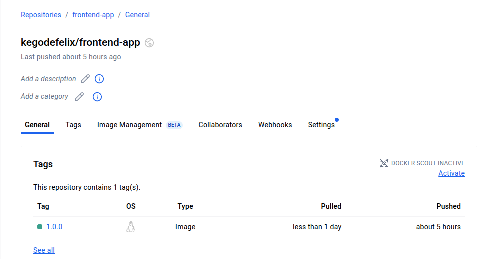
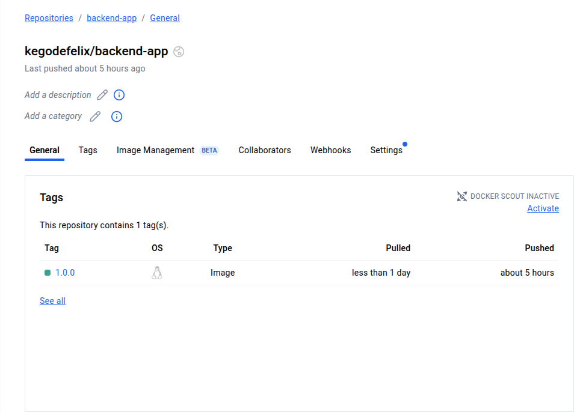

 ## 1. Selection of the foundation image against which a given container may be built.
Frontend: applied `node:18-alpine` due to it being  lightweight and secure.
Backend: The node:18-alpine was the choice since it is the latest LTS-based lightweight and secure image.
MongoDB:`mongo:6.0` image is stable as it already exists in docker hub.

 ## 2. Dockerfile commands that were used to create and run every container.

The working directory is set to `/app/* immediatly below `test_file` by setting `WORKDIR`.
COPY copies its dependencies to ./app first because this improves caching.
Packages are installed using the command `RUN npm install`.
The frontend port is accessible by `EXPOSE 5000`.
The backend port is exposed by `EXPOSE 5000`.
The app is run by the command `CMD ["npm", "start"]`.

 ## 3. Docker Compose Networking

Applied a special bridge network (`ecommerce-network`) to perform service-to-service communication.
Specified ports per service in order to not conflict and permit local testing.

 ## 4. Creation of a volume and use of docker-compose 

Specified `my-products` volume as data persistence even through restarting of containers.

 ## 5 Debugging

viewed logs using `docker logs`.
Reset environment by `docker-compose down -v` and `docker-compose up --build`.
Ran `docker ps` and `docker exec` to make sure the services are healthy.

 ## 6. Deployed docker image screenshot

